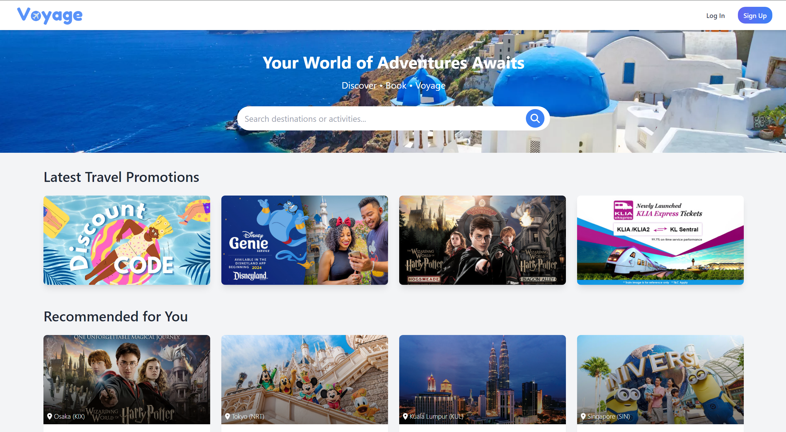

# Voyage - Travel Application



## Description

Voyage is a travel planning platform designed to alleviate the stress and time-consuming nature of organizing trips. Motivated by the common frustrations of travelers—such as planning fatigue, uncertainty in quality, and limited time—Voyage offers a seamless, curated travel experience that simplifies booking accommodations, flights, and more. By providing personalized recommendations and automating the planning process, Voyage transforms travel preparation into a smooth, enjoyable experience, allowing users to focus on making the most of their journey.

## Features

### Register & Login
Users can register for an account by providing their first name, last name, a valid email and password. We use client-side validation to verify that these fields are formed correctly. We store passwords after hashing with a salt using bcrypt. 

The login form has an initial client-side validation: email format is checked with a regex, and password must have at least six characters. 

Upon successful registration or valid credential entry, the server returns user information along with a JWT, and the client redirects back to the landing page as logged-in. The JWT is used for authentication and has a 30-minute time-out. The token is stored in the browser's local storage and is deleted on log-out.

### Landing Page Functions
The landing page can be visited by both registered and non-registered users. 
- Users can click on the "Discount Code" card to view available codes to apply for discounts at checkout. As of now, the discount codes use a basic implementation: they have unlimited uses so long as the code still exists in the database.
- A search bar implemented using a case-insensitive regex in the backend.
- Featured travel packages that, once clicked on, searches for associated trips. 
- Randomly selected assortment of trips.

### Basic Travel Package Customization
For each travel package, the user can edit the departure date (by default, it is set to tomorrow's date) and the travelers. A discount code can also be applied. 

### Cart
Travel packages can be added to the cart. Items in the cart can be edited or deleted. Multiple items in the cart can be selected for checkout at the same time, and a discount code can also be applied to the selected items. 
- Trips in the cart are stored as references, so they update with the trip in the database. 
- If a trip is deleted from the database, the client will still display the trip card, but the information will be missing. Clicking on the item to edit it will redirect to an error page. If the user tries to check out a deleted trip, the server will delete those items from the user's cart and return an error. 

### Bookings
Once the user clicks pay or checkout for displayed trips or from their cart, a booking is created. The booking records all essential information of the trip(s), including traveler names, departure date, discount code and total discount amount. Trip information is copied, not referenced, so that we can still access them even after the trip is deleted from the database. This however is not space-efficient; other solutions such as a soft-delete may be more suitable.

### User Profile
Users can edit their personal information except for email and password. They can also upload a profile picture, which is then stored in Cloudinary, a cloud-based digital asset platform. 

### Admin Functions
An admin is a user with an `isAdmin` value of `true` hard-coded in the database. We use the same login page as non-admin users, but admins are redirected to the admin section. The admin page provides a UI for performing basic CRUD operations for coupons and travel packages, as well as cancelling booked trips.

## Installation

If you would like to run the project locally, follow the steps below. 

1. Clone the repository.

```
git clone https://github.com/patb-github/voyage-app-mern.git
```

2. Go into the voyage-app-mern/frontend directory and install dependencies using npm or pnpm.

```
pnpm install
```

3. Repeat step 2 for the voyage-app-mern/backend directory.
4. Add a .env file to the voyage-app-mern/backend directory and add the following environment variables:
- `MONGO_URI` - connection string for MongoDB
- `PORT` - server port
- `JWT_SECRET` - secret key for JWT tokens
- `CLOUDINARY_CLOUD_NAME`
- `CLOUDINARY_API_KEY`
- `CLOUDINARY_API_SECRET` 

5. Add a .env file to the voyage-app-mern/frontend directory and add `VITE_BASE_URL` as an environment variable. It must be the same as `PORT` in the backend environment.

6. Run the program: in voyage-app-mern/frontend, run
```
pnpm run dev
```
7. Repeat step 6 for voyage-app-mern/backend in another terminal window.
## Credits

This web-application was a group project for Generation Thailand's Junior Software Developer Bootcamp (Cohort 7). To see the original organization and repositories, please visit [Atreides-Group-5](https://github.com/Atreides-Group-5).

## License

This project is licensed under the MIT License.